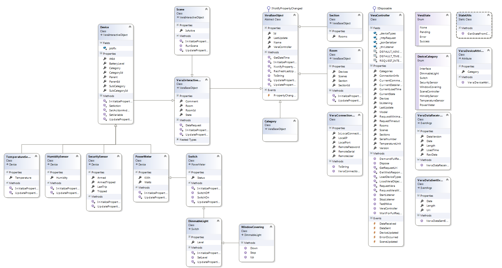
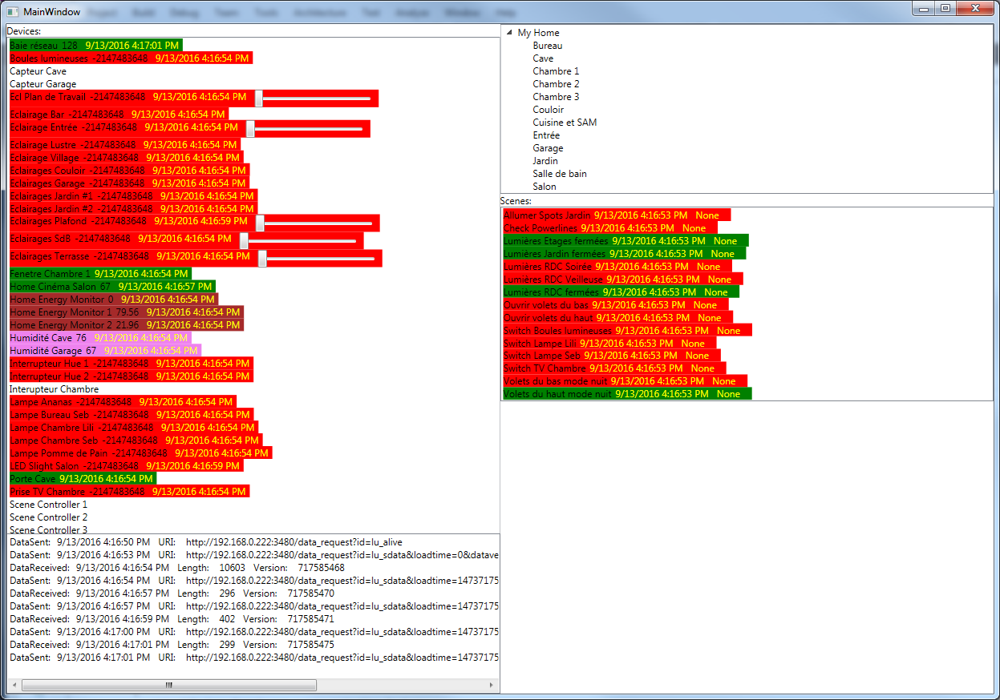

# Vera/Z-Wave API for .NET

This is a .NET library for Vera device (*Mi Casa Verde Z-Wave box*).

[http://getvera.com/](http://getvera.com/)

Example :

```csharp
using (VeraController vera = new VeraController(new VeraConnectionInfo("192.168.0.222"))) 
{
    vera.WaitForFullRequest();
    foreach (var device in vera.Devices)
    {
        Console.WriteLine("{0}: {1} ({2})", device.GetType().Name, device.Name, device.Room?.Name ?? "No room");
    }
    Console.WriteLine("Closing ...");
}
```

You can connect to local or remote device :

```csharp
// Local access
var vera = new VeraController(new VeraConnectionInfo("192.168.0.222"));

// Remote access
var vera = new VeraController(new VeraConnectionInfo("username", "password", "S/N");
```

Start the listener when connected for receiving in real time all changes on your Vera (Scene or devices updates) :

```csharp
var vera = new VeraController(new VeraConnectionInfo("192.168.0.222"));
vera.StartListener();
```

The Vera controller exposed the following properties :
- Sections
- Rooms
- Categories
- Scenes
- Devices
- Others informations about the current data version, model, state, last update, etc...

Each sections, rooms, categories, scenes and devices are VeraBaseObject witch implement the INotifyPropertyChanged to raise event when data change.



For example to enumerate all your Vera devices :

```csharp
foreach (var item in controller.Devices)
{
    Console.WriteLine("{0} is {1}", item.Name, item.GetType().Name);
}
```

To enumerate all "Switch" devices (switch, dimmable light or windows covering by inheritance) and show state :

```csharp
foreach (var item in controller.Devices.Where(d => d is Switch))
{
    Console.WriteLine("{0} is {1}", item.Name, ((Switch)item).Status ? "ON" : "OFF");
}
```

To show the temperature of a sensor :

```csharp
var bedroomSensor = controller.Devices.First(d => d.Name == "Bedroom Temperature Sensor");
Console.WriteLine("{0} = {1}�{2}", bedroomSensor.Name, bedroomSensor.Temperature, controller.TemperatureUnit);
```

To run a scene :

```csharp
var myScene = controller.Scenes.First(d => d.Name == "My Demo Scene");
myScene.RunScene();
```

To close all shutters in a specific room :

```csharp
var bedroomShutters = controller.Devices.Where(d => d is WindowCovering && d.Room.Name == "Bedroom").ToList();
bedroomShutters.ForEach(d => d.SwitchOff());
```

To monitor the device's changes :

```csharp
controller.DeviceUpdated += (s, e) =>
{
    Console.WriteLine("The device '{0}' is updated", e.Device.Name);
};
```

To monitor a specific property changes of a device :
```csharp
var bedroomSensor = controller.Devices.First(d => d.Name == "Bedroom Temperature Sensor");
bedroomSensor.PropertyChanged += (s, e) =>
{
    Console.WriteLine("The property '{0}' on the device {0} changed", e.PropertyName, bedroomSensor.Name);
};
```

The solution contains a WPF sample application to view and control in real time all devices, scenes and rooms connected to your Vera :




License
----

Apache License
